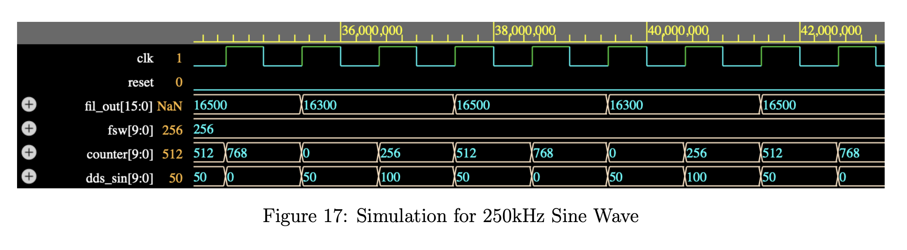

# Custom 32 Tap FIR Low Pass Filter Design Integrated with Previously Developed Direct Digital Synthesizer

## System Architecture

## Filter Design in Matlab

I used the Matlab Filter Designer (Previously FDA Tool) to design a Low Pass Filter which allows frequencies till 75kHz and stops frequencies greater than 125kHz. It is a 31 Order Filter. Sampling Frequency of the filter is kept 1MHz matching that of DDS.

### Configuring LPF in Matlab Filter Designer

I have exported the coefficients of the above filter with the name of ’LPF’ in the workspace. I then made all negative coefficients in the LPF matrix equal to zero, in order to not deal with signed binary representation in Verilog.

### Filter after setting negative coefficients to zero

We can see that the magnitude response is considerably different than what we were getting originally. Which can affect our filtered output.

### Testing the Filter on Matlab Generated Sine Waves

Will be testing for 10kHz, 50kHz, 200kHz and 250kHz frequencies.

#### 10kHz Matlab Generated Sine Wave Results

#### 50kHz Matlab Generated Sine Wave Results

#### 200kHz Matlab Generated Sine Wave Results

#### 250kHz Matlab Generated Sine Wave Results

## Converting Filter Coefficients to 8 Bit Binary Representation

The Matlab Script for this is [this](https://github.com/huzaifahtariqahmed/Integrated-DDS-FIR-Low-Pass-Filter/blob/main/low_pass_filter.mlx).

## Filter Implementation in Verilog

### FIR Low Pass Filter

The Verilog Code for this is [this](https://github.com/huzaifahtariqahmed/Integrated-DDS-FIR-Low-Pass-Filter/blob/main/fir_low_pass_filter.v).

### Top Level Module

This Combines the above filter with the two modules [phase counter](https://github.com/huzaifahtariqahmed/Direct-Digital-Synthesizer/blob/main/DDS%20Verilog%20Scripts/phase_counter.v) and [phase to amplitude](https://github.com/huzaifahtariqahmed/Direct-Digital-Synthesizer/blob/main/DDS%20Verilog%20Scripts/phase_to_amplitude.v) of the DDS.

The Verilog Code for Top Level Module is [this](https://github.com/huzaifahtariqahmed/Integrated-DDS-FIR-Low-Pass-Filter/blob/main/top_module.v).

### Test Bench

Test Bench can be found [here](https://github.com/huzaifahtariqahmed/Integrated-DDS-FIR-Low-Pass-Filter/blob/main/tb_top_module.v).

## Results

In verilog simulation I printed the time, counter, DDS sine wave amplitude values, and filtered output amplitude values in the logs. I then copied these output log values into a .txt file and used matlab to parse through it and generate one wave using dds output values and other using filtered output values, both against the time values. However for filtered output I also divided the values by 256 and then plotted them.

### 10kHz Sine Wave

I am adding the matlab script used for this, for just the 10kHz Sine Wave, as it is pretty much the same for other Sine Waves.

#### Simulation

#### Matlab Script Used for Plotting

Can be found [here](https://github.com/huzaifahtariqahmed/Integrated-DDS-FIR-Low-Pass-Filter/blob/main/low_pass_filter.mlx)

#### Plots

### 50kHz Sine Wave

#### Simulation

#### Plots

### 200kHz Sine Wave

#### Simulation

#### Plots

### 250kHz Sine Wave

#### Simulation

#### Plots

In these Verilog Results you may notice a completely zero magnitude at the start. That is basically the period of don’t care where the window is filling itself. For plotting purposes I have assumed don’t care values to be zero. We can also notice a phase change in both Matlab and Verilog Results, whenever we have a filtered output. That is just a delay because of the characteristics of the filter we designed.

--- 

**Contributions**: All of the code in this repository is written by [Huzaifah Tariq Ahmed](https://github.com/huzaifahtariqahmed). 
