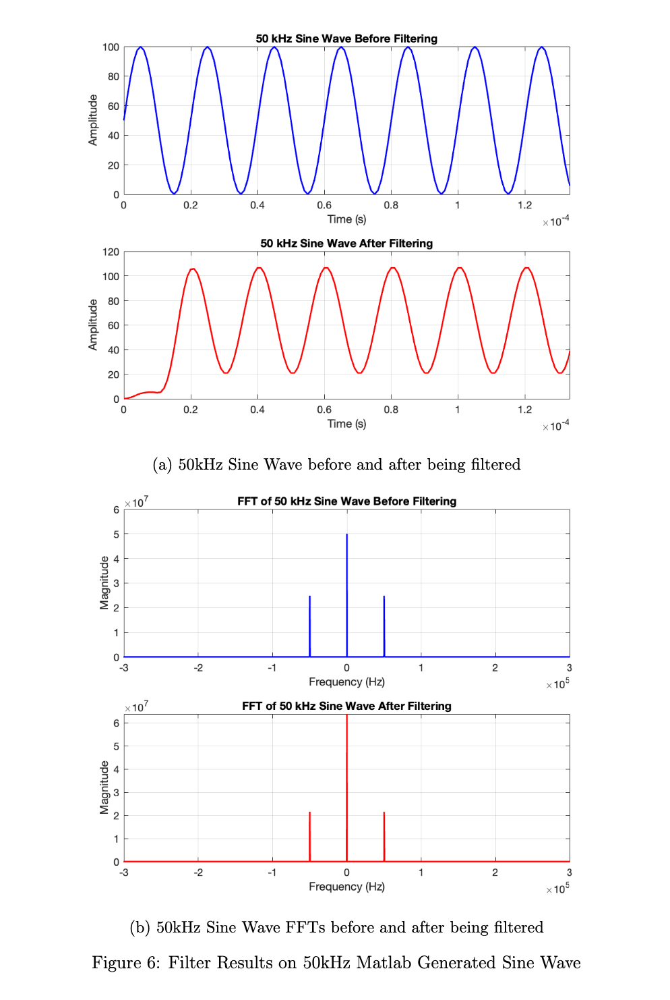

# Custom 32 Tap FIR Low Pass Filter Design Integrated with Previously Developed Direct Digital Synthesizer

## System Architecture

## Filter Design in Matlab

I used the Matlab Filter Designer (Previously FDA Tool) to design a Low Pass Filter which allows frequencies till 75kHz and stops frequencies greater than 125kHz. It is a 31 Order Filter. Sampling Frequency of the filter is kept 1MHz matching that of DDS.

### Configuring LPF in Matlab Filter Designer

I have exported the coefficients of the above filter with the name of ’LPF’ in the workspace. I then made all negative coefficients in the LPF matrix equal to zero, in order to not deal with signed binary representation in Verilog.

### Filter after setting negative coefficients to zero

We can see that the magnitude response is considerably different than what we were getting originally. Which can affect our filtered output.

### Testing the Filter on Matlab Generated Sine Waves

Will be testing for 10kHz, 50kHz, 200kHz and 250kHz frequencies.

#### 10kHz Matlab Generated Sine Wave Results

#### 50kHz Matlab Generated Sine Wave Results

#### 200kHz Matlab Generated Sine Wave Results

#### 250kHz Matlab Generated Sine Wave Results

## Converting Filter Coefficients to 8 Bit Binary Representation

The Matlab Script for this is [this](https://github.com/huzaifahtariqahmed/Integrated-DDS-FIR-Low-Pass-Filter/blob/main/low_pass_filter.mlx).

## Filter Implementation in Verilog

### FIR Low Pass Filter

The Verilog Code for this is [this](https://github.com/huzaifahtariqahmed/Integrated-DDS-FIR-Low-Pass-Filter/blob/main/fir_low_pass_filter.v).

### Top Level Module

This Combines the above filter with the two modules [phase counter](https://github.com/huzaifahtariqahmed/Direct-Digital-Synthesizer/blob/main/DDS%20Verilog%20Scripts/phase_counter.v) and [phase to amplitude](https://github.com/huzaifahtariqahmed/Direct-Digital-Synthesizer/blob/main/DDS%20Verilog%20Scripts/phase_to_amplitude.v) of the DDS.

The Verilog Code for Top Level Module is [this](https://github.com/huzaifahtariqahmed/Integrated-DDS-FIR-Low-Pass-Filter/blob/main/top_module.v).

### Test Bench

Test Bench can be found [here](https://github.com/huzaifahtariqahmed/Integrated-DDS-FIR-Low-Pass-Filter/blob/main/tb_top_module.v).

--- 

**Contributions**: All of the code in this repository is written by [Huzaifah Tariq Ahmed](https://github.com/huzaifahtariqahmed). 
